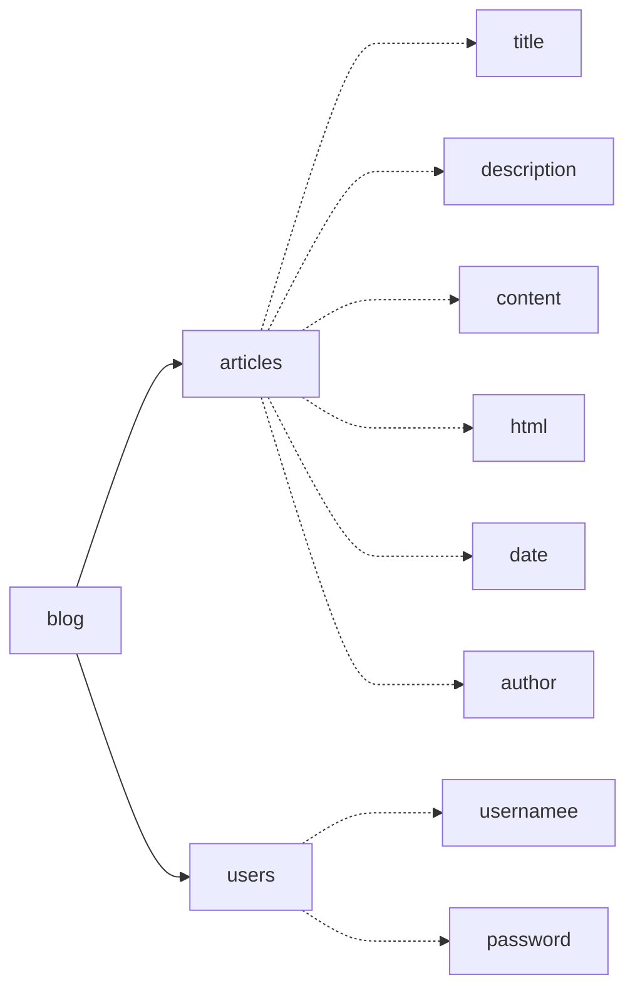

# 新生项目课程：云计算环境下的博客系统开发实践
## 开发环境：
1. 操作系统：WIndows11
2. 编程工具：Visual Studio
3. 浏览器：Edge浏览器
## 项目描述：
本项目使用 Node.js 作为后端运行环境，Express 框架来处理 HTTP 请求，以及 MongoDB 作为数据库存储文章及用户数据，实现了用户的注册和登录功能，以及用户对文章的增，删，改，查等基础功能
## 功能实现：
### 数据库结构：


### 代码具体讲解：
1.数据库模型

```
const mongoose = require('mongoose');
const marked = require('marked')
const user = require('./user');//关联文章与用户

const articleSchema = new mongoose.Schema({
    title: String,
    description: String,
    content: String,//原始md文件格式
    html: String,//展示html文件格式
    createdAt: {type: Date, default: Date.now},
    author: {
        type: mongoose.Schema.Types.ObjectId,//文章作者，通过ObjectId引用用户集合
        ref: 'user'
    }
});

articleSchema.pre('validate', function(next) {
  if (this.content) {
    this.html = marked(this.content)
  }
  next()//将文章转化为html并储存在html字段中
})

module.exports = mongoose.model('article', articleSchema)
```

2. 各页面的ejs文件的编写
```
<!DOCTYPE html>
<html lang="en">
<head>
  <title>Blog</title>
  <link rel="stylesheet" type="text/css" href="/css/bootstrap.min.css" />
  <style>
  .left {float: left;}
  .right {float: right;}
  .clear {clear: both;}//设置浮动样式
  body{
    background: url("/image/background.png") no-repeat fixed center;//设置背景图片
    color: white;
  }
  .card-body{
    background-color: rgba(0, 0, 0, 0.6);
  }
  </style>
</head>
<body>
  <div class="container">
    <h1 class="mt-4 left">Articles</h1>
    <h1 class="mt-4 right"><%= name %></h1>
    <div class="clear">
    <hr/>
    <a href="/new" class="btn btn-success">New Article</a>
    </div>
    <% articles.forEach(article => { %>//检索并渲染文章
    <div class="card mt-4 bg-transparent">
        <div class="card-body">
        <h2><%= article.title %></h2>//标题
            <div class="text-muted mb-2">
               <%= article.createdAt.toLocaleDateString() %>//日期
            </div>
        <p><%= article.description %></p>//文章信息和简介
        <a href="/display/<%= article._id %>" class="btn btn-primary">Read More</a>//展开内容链接
        <a href="/edit/<%= article._id %>" class="btn btn-info">Edit</a>//编辑链接
        <form action="/<%= article._id %>?_method=DELETE" method="POST" class="d-inline">
            <button type="submit" class="btn btn-danger">Delete</button>//删除链接
        </form>
        </div>
    </div>
    <% }) %>
  </div>
</body>
</html>
```

```
<html>
<head>
  <title>Blog Edit</title>
  <link rel="stylesheet" type="text/css" href="/css/bootstrap.min.css" />
  <style>
  body{
    background: url("/image/background.png") no-repeat fixed center;//背景图片设置
    color: white;
  }
  .card-body{
    background-color: rgba(0, 0, 0, 0.6);
  }
  </style>
</head>

<body>
<div class="container">
<h1>Edit Article</h1>
<form action="/<%= article._id %>?_method=PUT" method="POST">//使用post方法更新内容
<div class="card mt-4 bg-transparent">
    <div class="card-body">//使用Bootstrap卡片用于组织表单内容
    <div class="form-group">
    <label for="title">Title</label>
    <input required value="<%= article.title %>" type="text" name="title" id="title" class="form-control bg-transparent text-light">//标题输入框
    </div>

    <div class="form-group">
    <label for="description">Description</label>
    <textarea name="description" id="description" class="form-control bg-transparent text-light"><%= article.description %></textarea>//文章简介输入框
    </div>

    <div class="form-group">
    <label for="content">Content</label>
    <textarea name="content" id="content" class="form-control bg-transparent text-light"><%= article.content %></textarea>//文章内容输入框
    </div>

    <a href="/" class="btn btn-secondary">Cancel</a>//取消
    <button type="submit" class="btn btn-primary">Save</button>//保存
    </div>
</div>    
</form>
</div>
</body>

</html>
```

3. 文章的增删改查功能
```
//索引
router.get('/', requireLogin, async (req, res) => {
    const all = await article.find({ author: req.session.oneuser._id }).sort({ createdAt: 'desc' });
    res.render('index', { articles: all, name: req.session.oneuser.username })
})

//新增
router.get('/new', requireLogin, (req, res) => {
  res.render('new');
})

router.post('/new', requireLogin, async (req,res) => {
    one = new article({ title: req.body.title, description: req.body.description, content: req.body.content, author: req.session.oneuser._id });
    await one.save();
    res.render('display', { article: one })
})

//编辑
router.get('/edit/:id', requireLogin, async (req, res) => {
    const one = await article.findOne({ _id: req.params.id });
    res.render('edit', { article: one })
})

router.put('/:id', requireLogin, async (req, res) => {
    let data = {}
    data._id = req.params.id
    data.title = req.body.title
    data.description = req.body.description
    data.content = req.body.content

    var one = await article.findOne({ _id: req.params.id });
    if (one != null) {
        one.title = data.title;
        one.description = data.description;
        one.content =data.content;
        await one.save();       
    }  
    res.redirect(`/display/${req.params.id}`)
})
```

## 项目总结
该项目基本实现了一个简易博客系统的功能，通过完成这个项目，我学会了基本的JavaScript和html语法，深入理解了网页前后端的运行逻辑。对用户登录注册系统的理解有待提高。

## 工作量统计表
| 统计 | 基础功能 | 新增功能1 | 新增功能2 | 新增功能3 | 新增功能4 | 新增功能5 |
| :--------: | :--------: | :--------: | :--------: | :--------: | :--------: | :--------: |
| 描述 | 博客系统增删改查功能 | 目录结构优化 | 记录文章创建时间并排序 | 添加markdown输入框 | 博客界面美化 | 用户注册登录与验证系统 |
| 学时 | 8 | 2 | 2 | 2 | 2 | 12 | 
